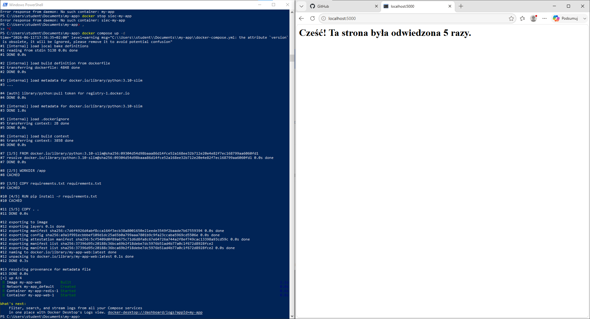
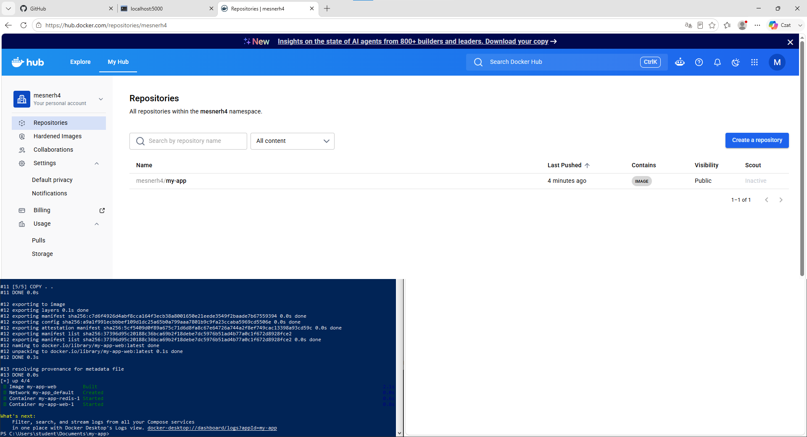
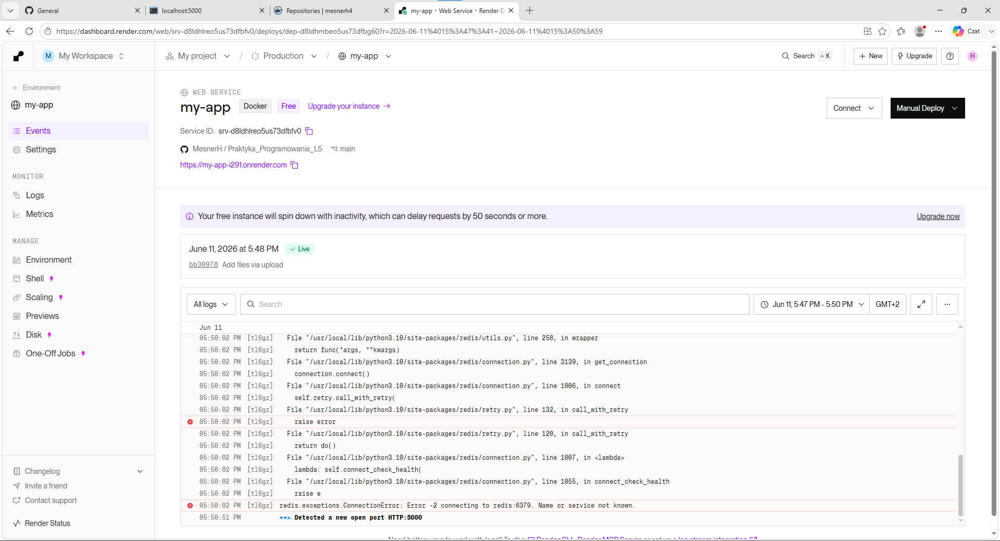
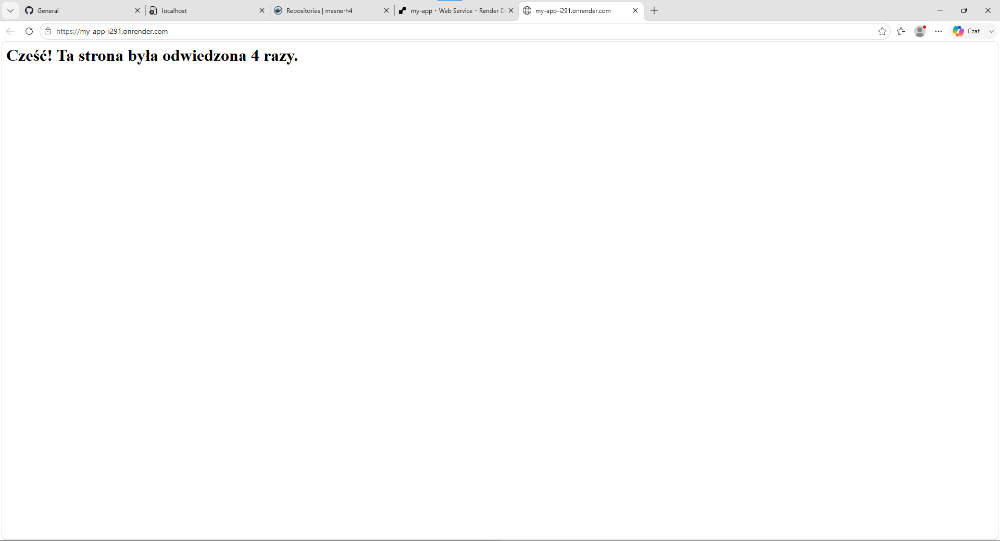
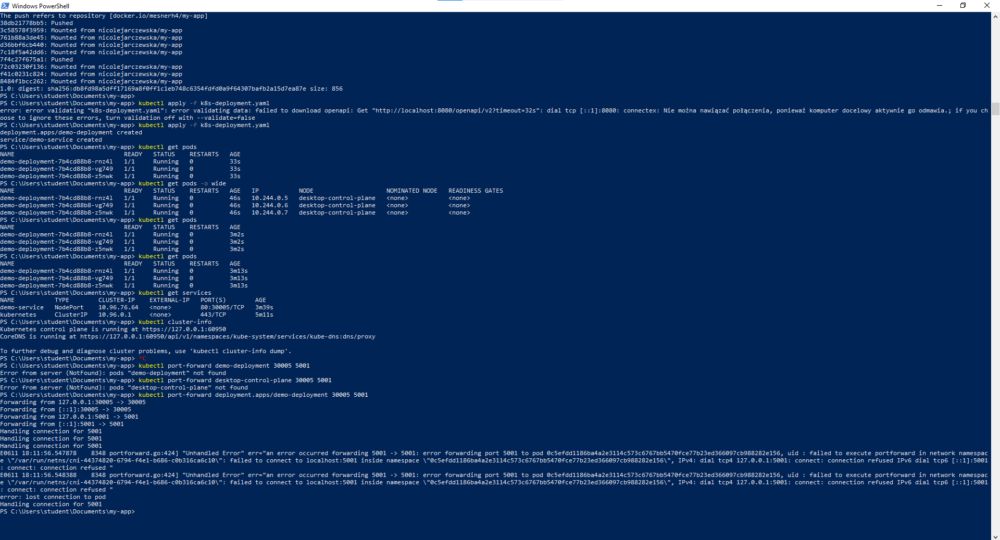
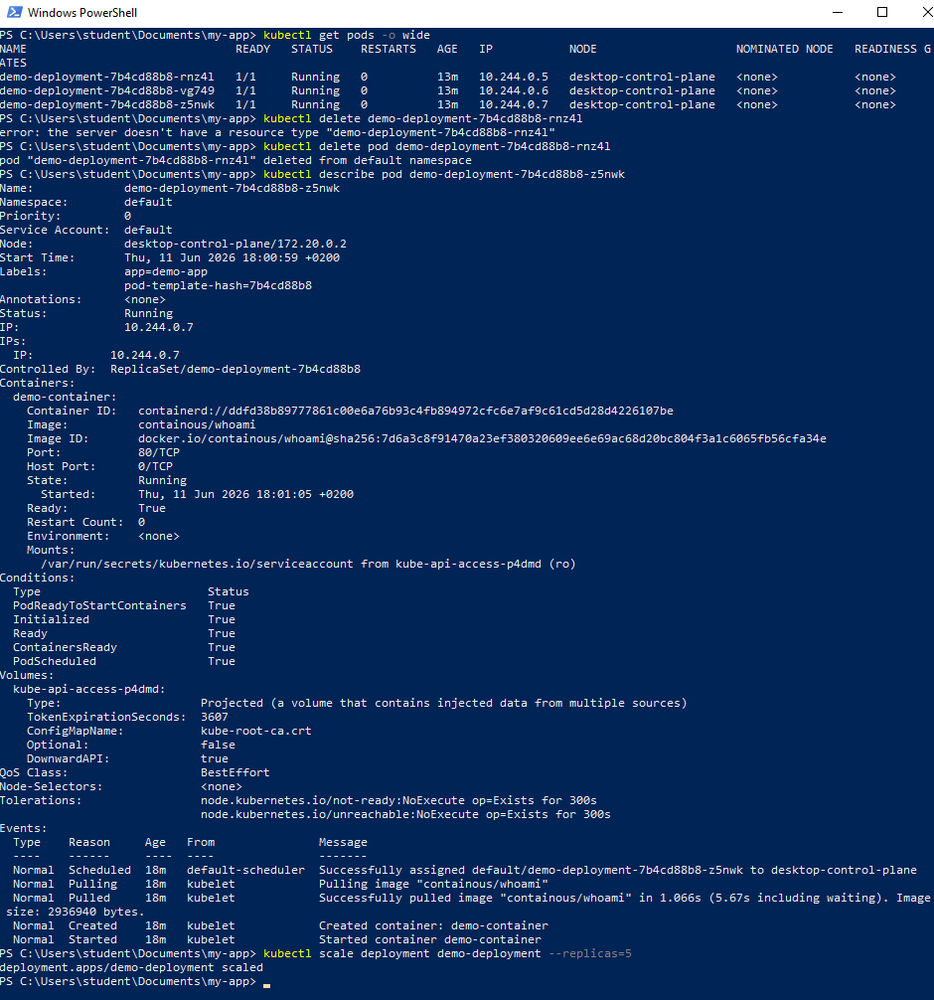

# ImageApp
Autor: Hubert Missar  
Indeks: 280110  
Repozytorium: https://github.com/MesnerH/Praktyka_Programowania_L5

## 4.3 Uruchomienie Docker Compose

## 5.1 Umieszczenie obrazu w publicznym rejestrze

## 5.2 Wdrożenie obrazu na chmurę Render

## 5.3 Dodanie instancji bazy danych

## 6.2.3 Uruchomienie klastra Kubernetess

## 6.2.4 Testy klastra Kubernetess

